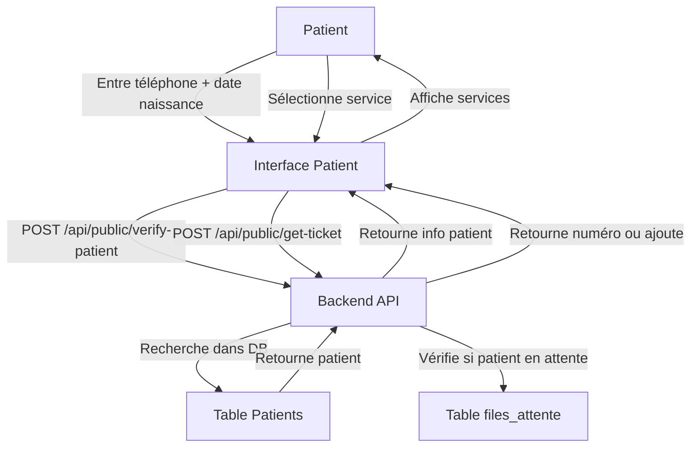

# Plan: Récupération du numéro de passage pour patients existants

## Objectif
Permettre aux patients existants de récupérer leur numéro de passage via l'interface patient en utilisant leur numéro de téléphone et date de naissance comme méthode d'identification.

## Architecture du système



## Étapes d'implémentation

### 1. Backend - Recherche de patient existant
**Fichier:** `backend/models/Patient.js`
- Ajouter une méthode `findByPhoneAndBirthDate(telephone, date_naissance)` qui recherche un patient par téléphone et date de naissance

### 2. Backend - Récupération du numéro de passage
**Fichier:** `backend/controllers/queueController.js`
- Créer une nouvelle fonction `getPatientTicket` qui:
  - Reçoit `telephone` et `date_naissance` et `service_id`
  - Vérifie si le patient existe
  - Cherche un numéro de passage actif (statut 'en_attente' ou 'en_cours') pour ce patient
  - Si trouvé, retourne le numéro existant
  - Si pas trouvé, crée une nouvelle entrée dans la file d'attente

### 3. Backend - Routes API publiques
**Fichier:** `backend/index.js`
- Ajouter route `POST /api/public/verify-patient` - Vérifie l'identité du patient
- Ajouter route `POST /api/public/get-ticket` - Récupère ou crée le numéro

### 4. Frontend - Composant de récupération
**Fichier:** `frontend/src/components/PatientCheckIn.tsx` (modification)
- Ajouter un onglet/mode pour patients existants
- Formulaire avec:
  - Champ téléphone
  - Champ date de naissance
  - Bouton de vérification
- Après vérification:
  - Afficher le nom du patient
  - Liste des services disponibles
  - Sélection de service
  - Bouton pour obtenir/récupérer le numéro

### 5. Frontend - Intégration
**Fichier:** `frontend/src/App.tsx`
- Ajouter une route `/patient/retrieve` ou intégrer dans PatientCheckIn

## Structure de données

### Requête verify-patient
```json
{
  "telephone": "2439xxxxx",
  "date_naissance": "1990-01-15"
}
```

### Réponse verify-patient
```json
{
  "found": true,
  "patient": {
    "id": 1,
    "nom": "MUKAMA",
    "prenom": "Jean",
    "date_naissance": "1990-01-15",
    "telephone": "2439xxxxx"
  }
}
```

### Requête get-ticket
```json
{
  "patient_id": 1,
  "service_id": 3,
  "priorite": "normal"
}
```

### Réponse get-ticket
```json
{
  "message": "Numéro récupéré" | "Nouveau numéro créé",
  "queue_id": 15,
  "numero": 7,
  "statut": "en_attente" | "en_cours",
  "temps_attente_estime_minutes": 45
}
```

## Cas d'usage

1. **Patient vérifié avec numéro actif**: Affiche le numéro actuel et le temps d'attente
2. **Patient vérifié sans numéro actif**: Propose de prendre un nouveau numéro
3. **Patient non trouvé**: Propose de s'enregistrer comme nouveau patient
4. **Numéro terminé (statut ' Propose de prendre un nouveau numéro

## Ftermine')**:ichiers à modifier

| Fichier | Action |
|---------|--------|
| `backend/models/Patient.js recherche` | Ajouter méthode par téléphone + date naissance |
| `backend/controllers/queueController.js` | Ajouter fonction getPatientTicket |
| `backend/index.js` | Ajouter routes API publiques |
| `frontend/src/components/PatientCheckIn.tsx` | Ajouter formulaire récupération |
| `frontend/src | Ajouter types pour/types/index.ts` les nouvelles réponses |
